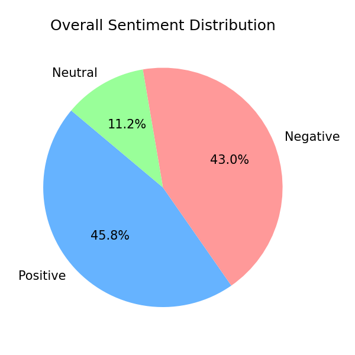
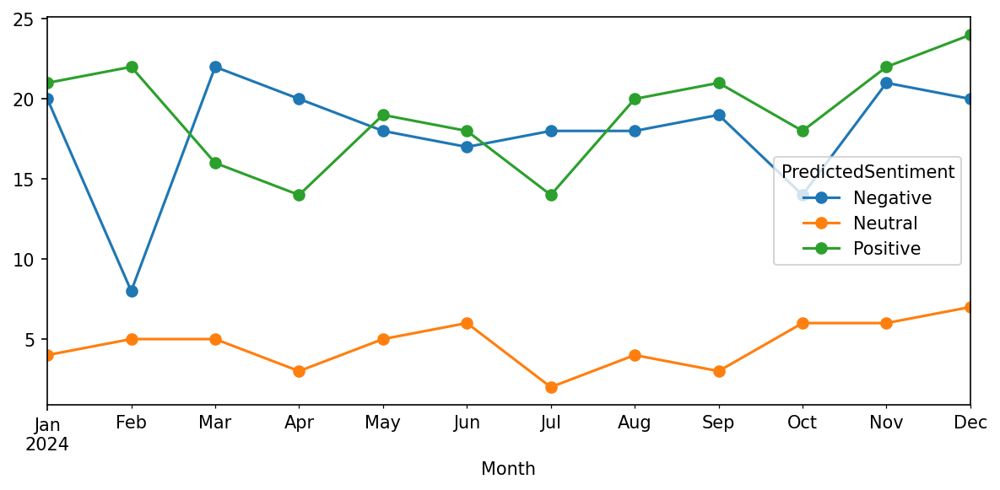
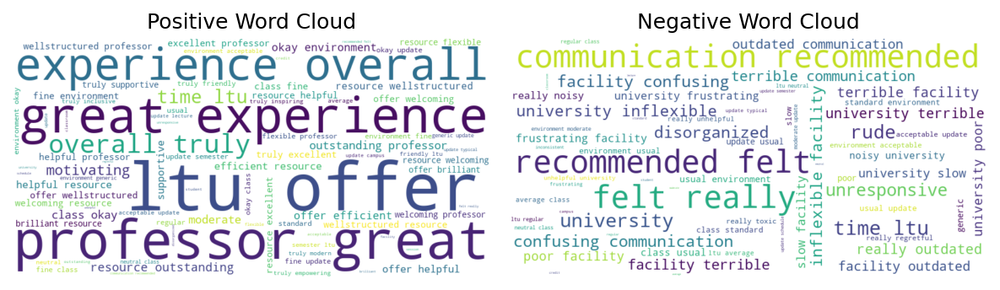
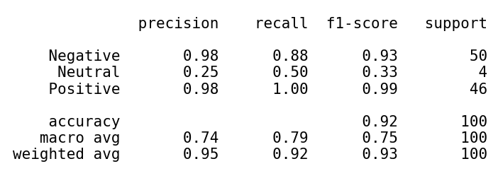

# Social Media Sentiment Analysis – Lawrence Technological University

## Overview
In this project, I analyzed social media feedback related to Lawrence Technological University using Natural Language Processing (NLP) techniques. I classified posts into positive, negative, and neutral sentiments using TextBlob, achieving 92% accuracy. The analysis helped identify key themes such as communication challenges and positive academic experiences. Overall, this project demonstrates how unstructured text data can be transformed into actionable insights for better decision-making.

## Problem Statement
Universities receive large volumes of unstructured feedback from platforms like Twitter, Reddit, and Glassdoor. However, manually analyzing this data is time-consuming and inefficient, making it difficult to understand overall sentiment and identify key issues. This project aims to automate sentiment analysis to help institutions better understand user opinions and improve decision-making.

## Tools & Technologies
- Python  
- Pandas (Data Processing)  
- NLTK (Text Preprocessing)  
- TextBlob (Sentiment Analysis)  
- Matplotlib & Seaborn (Data Visualization)  
- Jupyter Notebook  

## Dataset
The dataset consists of 500 social media posts related to Lawrence Technological University, collected from platforms such as Twitter, Reddit, and Glassdoor. Each record includes text content, platform, date, and sentiment labels. The dataset is designed to simulate real-world user feedback with a balanced distribution of positive, negative, and neutral sentiments.

## Approach
- Cleaned and preprocessed text data (stopword removal, lemmatization, normalization)  
- Applied TextBlob for sentiment polarity scoring  
- Classified data into positive, negative, and neutral categories  
- Performed exploratory analysis to identify trends over time  
- Conducted n-gram analysis to extract key words and phrases  
- Built visualizations to analyze sentiment distribution and trends

## Results
- Achieved **92% sentiment classification accuracy**  
- Sentiment distribution:
  - Positive: 45.8%  
  - Negative: 43%  
  - Neutral: 11%  
- Identified recurring negative themes such as **poor communication and outdated systems**  
- Positive sentiment driven by **faculty support and academic experience**

## Visualizations

### Overall Sentiment Distribution

### Monthly Sentiment Trends

### Word Cloud

### Classification Report

## Key Insights
- Negative sentiment peaks during academic stress periods (e.g., midterms)  
- Positive sentiment increases during semester start and events  
- Social media is a strong indicator of student satisfaction and concerns  
- TextBlob performs well for simple sentiment but struggles with complex language  

## Business Impact
- Helps universities monitor student sentiment in real time  
- Enables early identification of issues (communication, administration)  
- Supports data-driven improvements in student experience and operations  
- Provides insights for marketing, admissions, and institutional strategy  

## Project Files
- sentiment_analysis.ipynb  
- dataset.xlsx  
- sentiment_analysis_report.pdf  
- sentiment_analysis_presentation.pptx  

## Future Improvements
- Implement advanced NLP models (BERT, RoBERTa)  
- Integrate real-time social media data using APIs  
- Build interactive dashboards for continuous monitoring  
- Perform user-level sentiment segmentation  

## Author
**Rinku Patel**  
Data Analyst | Power BI | SQL | Python | Tableau  
